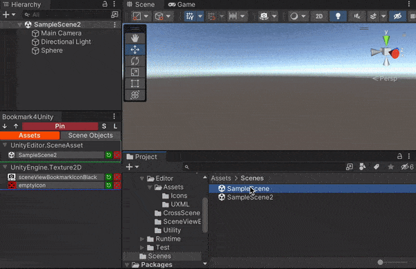
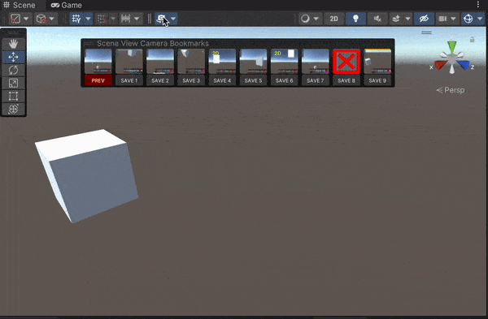

# Bookmark4Unity

A simple unity editor tool to provide basic bookmarking for scene objects, scene view camera positions, and project assets.

[CHANGELOG](https://github.com/superkerokero/Bookmark4Unity/blob/master/Assets/Bookmark4Unity/CHANGELOG.md)

## Install

1. Window > Package Manager
2. 「+」 > Add package from git URL
3. Use the following link to install
   - `https://github.com/superkerokero/Bookmark4Unity.git?path=/Assets/Bookmark4Unity`
4. You can install a specific version like this
   - `https://github.com/superkerokero/Bookmark4Unity.git?path=/Assets/Bookmark4Unity#1.1.1`

## Supported unity version

- 2021.3~

## Basic usage

### Bookmarking objects/assets

- Select objects/assets you want to bookmark, click the `Pin` button to pin it to the bookmark window.
- It is also possible to drag the objects/assets to bookmark window to bookmark them.
- You can also use keyboard shortcut to pin objects:
  - MacOS: `Alt + Cmd + A`
  - Windows: `Alt + Ctrl + A`

### Using and managing bookmarked objects/assets

- Using
  - Click bookmarked item inside bookmark window to select it
  - For bookmarked assets, click green `⎋` button to open it
  - For bookmarked scene objects, click camera button to focus on it
  - Bookmarked assets/scene objects can be **draged & droped** to places like project/hierarchy/scene views.
- Managing
  - To sort bookmarked assets by name, click `↓`/`↑` button at the left of `Pin` button
  - To remove a bookmark, click red `x` button on the item
  - To save collections to binary file, click `S` button at the right of `Pin` button, or use `Save Collections` from menu
  - To load collections from saved binary file, click `L` button at the right of `Pin` button, or use `Load Collections` from menu
  - To clear bookmarks quickly, use `Clear` options from menu

### Bookmarking scene view camera positions

- Enable the overlay
  - Press `space` inside the scene view to bring up overlay visibility menu, and turn `Bookmark4Unity` on
  - The new camera icon will appear on the top of scene view, click it to toggle the scene view bookmark overlay window
- Using the overlay
  - You can bookmark/restore camera positions by clicking corresponding slot buttons
  - The camera icon also provides a dropdown menu for bookmarking/restoring camera positions
- Using menu items(and keyboard shortcuts)
  - Alternatively, you can access the same dropdown menu from `Tools` → `Bookmark4Unity` → `Scene View Bookmarks`
  - The dropdown menu and keyboard shortcuts works even when the scene view overlay is off

## LICENSE

The bookmark editor tool itself is distributed under MIT license. However, it uses a modified version of cross scene reference to provide scene objects bookmarking, which is under [Unity Companion License](http://www.unity3d.com/legal/licenses/Unity_Companion_License) . Since this tool can't be used outside of unity anyway, feel free to do whatever you want with it.
