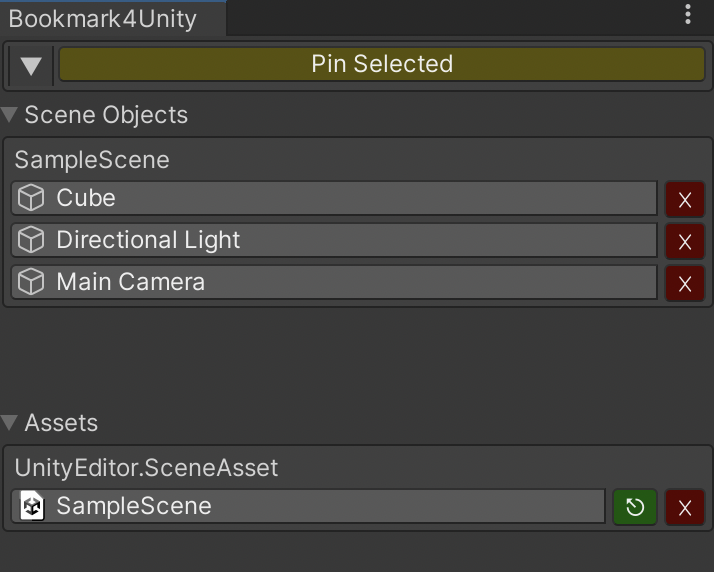

# Bookmark4Unity

A simple unity editor tool to provide basic bookmarking for scene objects and project assets.

## Install

1. Window > Package Manager
2. 「+」 > Add package from git URL
3. Use the following link to install
   - `https://github.com/superkerokero/Bookmark4Unity.git?path=/Assets/Bookmark4Unity`
4. You can install a specific version like this
   - `https://github.com/superkerokero/Bookmark4Unity.git?path=/Assets/Bookmark4Unity#1.0.0`

## Basic usage

### Bookmarking objects/assets

- Select objects/assets you want to bookmark, click the `Pin Selected` button to pin it to the bookmark window.
- You can also use shortcut to pin objects
  - MacOS: `Alt + Cmd + A`
  - Windows: `Alt + Ctrl + A`

### Managing bookmarked objects/assets

- Click bookmarked item inside bookmark window to select it
- For bookmarked assets, click green `⎋` button to open it
- To sort bookmarked assets by name, click `▼` button at the left of `Pin Selected` button
- To remove a bookmark, click red `x` button on the item
- To save collections to binary file, use `Save Collections` from menu
- To load collections from saved binary file, use `Load Collections` from menu

## LICENSE

The bookmark editor tool itself is distributed under MIT license. However, it uses a modified version of cross scene reference to provide scene objects bookmarking, which is under [Unity Companion License](http://www.unity3d.com/legal/licenses/Unity_Companion_License) . Since this tool can't be used outside of unity anyway, feel free to do whatever you want with it.
